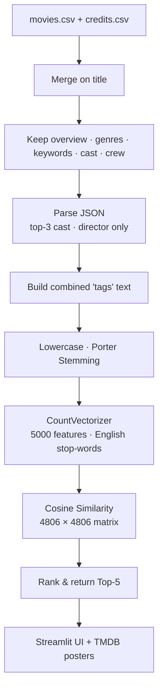

# 🎬 Movie Recommender System


A **content-based movie recommender** that suggests the **top 5 most similar movies** to any title you
pick. It turns each movie's metadata — overview, genres, keywords, cast, and director — into a text
"tag" profile, vectorizes it, and ranks movies by **cosine similarity**. Served through an interactive
**Streamlit** app with live posters from the **TMDB API**.

---

## 🎬 Live Demo

🌐 **Web Application:** https://movierecommender-sys.streamlit.app/

> Pick a movie from the dropdown and get 5 similar recommendations with posters.
> _(Deployable free on [Streamlit Community Cloud](https://streamlit.io/cloud).)_

---

## 📌 Project Overview

Instead of relying on user ratings, this **content-based** approach recommends movies that are similar
in *content*. Each film is described by a single combined text field built from its plot overview,
genres, keywords, top cast, and director. Movies whose text profiles point in a similar direction (in
vector space) are treated as similar — so picking *Avatar* surfaces other sci-fi/adventure titles.

The project has two parts:

- **🧪 Notebook** (`moviesRecommenderSystem.ipynb`) — data cleaning, feature engineering, and building
  the similarity model.
- **🖥️ App** (`app.py`) — a Streamlit UI that loads the pre-computed artifacts and serves recommendations.

---

## ✨ Features

- 🎯 Recommends the **top 5 most similar movies** for any title
- 🧠 **Content-based** filtering using movie metadata (no ratings needed)
- 📝 **NLP pipeline** — tag building, Porter stemming, and Count Vectorization
- 📐 **Cosine similarity** over a `4806 × 4806` movie matrix
- 🖼️ **Live posters** fetched from the TMDB API
- ⚡ Interactive **Streamlit** web interface

---

## 📊 Dataset

| | |
|---|---|
| **Source** | TMDB 5000 Movie Dataset |
| **Files** | `movies.csv` (metadata) · `credits.csv` (cast & crew) |
| **Movies** | 4,803 raw → **4,806** after merge & cleaning |

The two files are merged on `title`, and only the fields useful for content similarity are kept:

| Column | Used for |
|---|---|
| `overview` | plot description (split into words) |
| `genres` | genre names |
| `keywords` | plot keywords |
| `cast` | top 3 billed actors |
| `crew` | director only |

---

## 🏗️ Recommendation Pipeline



**Flow:** Load → Merge → Select → Parse → Build Tags → Stem → Vectorize → Cosine Similarity →
Top-5 → Streamlit App.

---

## 🔧 Feature Engineering

| Step | Detail |
|---|---|
| **Merge** | `movies.csv` + `credits.csv` on `title` |
| **Select** | `overview`, `genres`, `keywords`, `cast`, `crew` |
| **Parse** | `genres`/`keywords` → names · `cast` → top 3 · `crew` → director |
| **Normalize** | remove spaces inside names (e.g., `Sam Worthington` → `SamWorthington`) so each entity is one token |
| **Combine** | `tags = overview + genres + keywords + cast + crew` |
| **Text** | lowercase + **Porter stemming** (`loved`, `loving` → `love`) |
| **Vectorize** | `CountVectorizer(max_features=5000, stop_words='english')` |

Each movie becomes a **5000-dimensional** bag-of-words vector.

---

## 📐 Similarity Model

Similarity between two movies is the **cosine similarity** of their count vectors:

- Produces a **`4806 × 4806`** similarity matrix (every movie vs every movie)
- For a selected movie, scores are sorted and the **top 5** (excluding itself) are returned

The recommendation function is identical in the notebook and the app:

```python
def recommend(movie):
    index = movies[movies["title"] == movie].index[0]
    distances = similarity[index]
    top5 = sorted(list(enumerate(distances)), reverse=True, key=lambda x: x[1])[1:6]
    return [movies.iloc[i[0]].title for i in top5]
```

### 🎥 Example

`recommend("Avatar")` →

1. Titan A.E.
2. Small Soldiers
3. Independence Day
4. Ender's Game
5. Aliens vs Predator: Requiem

---

## 🌐 Web Application

A single-page **Streamlit** app (`app.py`):

- Loads the pre-computed artifacts once (`moives_dict.pkl`, `similarity.pkl`)
- **Searchable dropdown** to select any movie in the dataset
- **Recommend** button → shows 5 movies in a 5-column layout
- **Posters** are fetched live from the **TMDB API** by `movie_id`

> 🔑 **Poster API:** poster fetching calls the TMDB API. Use **your own** free TMDB API key
> (from [themoviedb.org](https://www.themoviedb.org/settings/api)) and keep it private rather than
> committing it to source control.

---

## 📁 Project Structure

```
Movie Recommender System/
├── app.py                          # Streamlit web app
├── moviesRecommenderSystem.ipynb   # data prep + similarity model
├── requirements.txt
│
├── movies.csv                      # TMDB 5000 — movie metadata
├── credits.csv                     # TMDB 5000 — cast & crew
│
├── moives_dict.pkl                 # processed movie dictionary (included)
└── similarity.pkl                  # cosine similarity matrix (generated by the notebook)
```

> ⚠️ `similarity.pkl` (~180 MB) is **not included** — generate it by running the notebook (see below).

---

## ⚙️ Installation

```bash
# 1. Clone the repository
git clone https://github.com/mitpatelcs/movie-recommender-system.git
cd "movie-recommender-system"

# 2. Create and activate a virtual environment
python -m venv .venv
source .venv/bin/activate        # macOS / Linux
# .venv\Scripts\activate         # Windows

# 3. Install dependencies
pip install -r requirements.txt
```

> The app needs `scikit-learn` and `nltk` only to **build** the artifacts in the notebook. If you plan
> to regenerate them, install those too: `pip install scikit-learn nltk`.

---

## ▶️ How to Run

**Step 1 — Generate the similarity matrix** (only needed once, since `similarity.pkl` isn't shipped):

Run all cells in `moviesRecommenderSystem.ipynb`. The final cells save:

- `moives_dict.pkl` — the processed movie data
- `similarity.pkl` — the cosine similarity matrix

**Step 2 — Launch the app:**

```bash
streamlit run app.py
# opens http://localhost:8501
```

Then pick a movie and click **Recommend**.

---

## 🖼️ Screenshots

> _Placeholders — add your own screenshots under an `images/` folder._

**Home Page**


**Recommendations**


---

## 🛠️ Tech Stack

| Category | Tools |
|---|---|
| **Language** | Python |
| **Data** | pandas, NumPy |
| **NLP / ML** | scikit-learn (CountVectorizer, cosine similarity), NLTK (Porter Stemmer) |
| **Web App** | Streamlit |
| **External API** | TMDB (movie posters) |
| **Notebook** | Jupyter |

---

## 🔮 Future Improvements

- 🔍 Add fuzzy / partial-text movie search
- 🖼️ Gracefully handle movies with missing posters
- ⚖️ Reduce `similarity.pkl` size (store only top-K neighbors per movie)
- 🤝 Add a hybrid (content + collaborative) recommender
- 🔐 Move the TMDB API key into environment variables / Streamlit secrets
- ☁️ Deploy on Streamlit Community Cloud

---

## 👤 Author

**Mit Patel**
---

## 📄 License

This project is intended for **educational purposes only**. The TMDB 5000 dataset and TMDB API are
subject to their respective terms of use.
